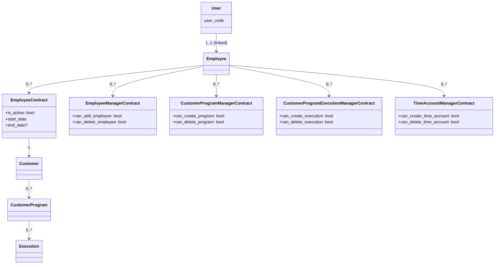
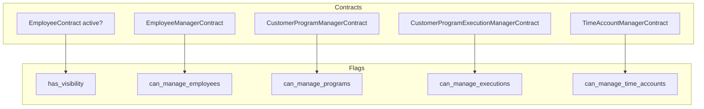

# Diagrams

This page provides high-level diagrams clarifying key relationships and how UI roles/flags map to contracts.

## Contracts and Access Control (overview)

Notes
- Base visibility requires an active EmployeeContract between the Employee and the Customer.
- Manager contracts grant specific action rights on top of base visibility.

## UI Roles & Template Flags

The UI exposes flags derived from active contracts. This guides which templates render and which actions are shown.

Legend
- has_visibility: set when there is an active EmployeeContract for the relevant Customer
- Other flags map 1:1 to their respective manager contracts’ booleans

See also
- Contracts & Access Control: `contracts-and-access-control.md`
- UI Roles & Rights: `ui-roles-and-rights.md`
- Admin guide: `admin.md`
